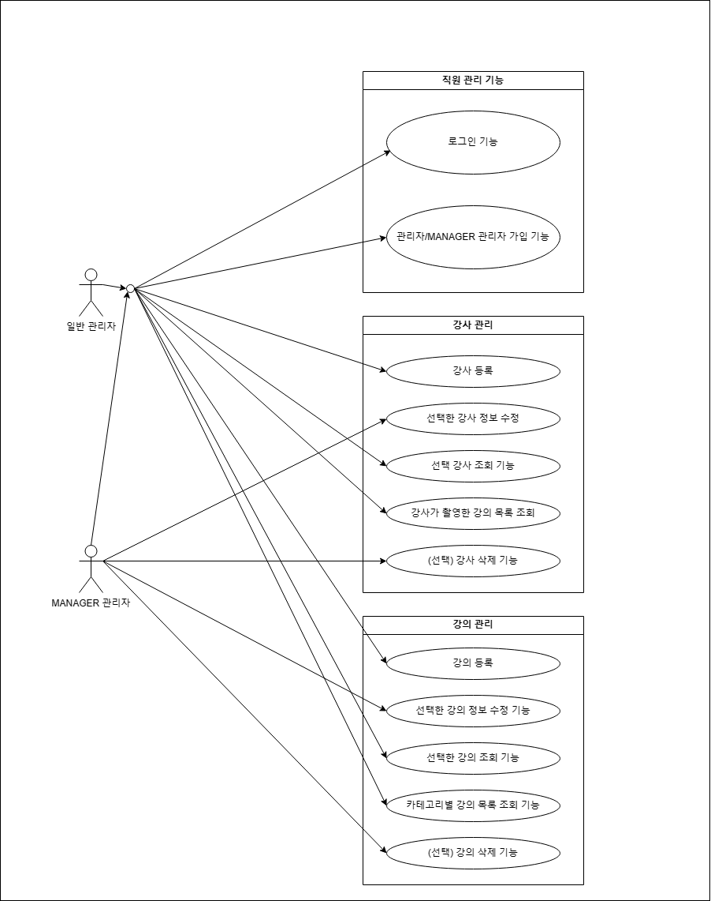
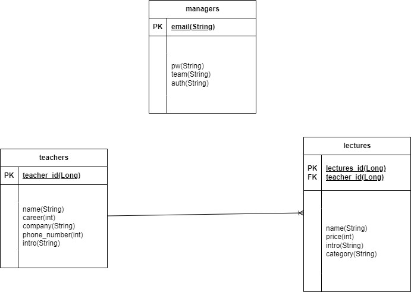
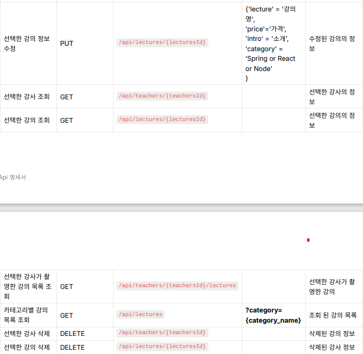

# 📋 백오피스

## 💻 프로젝트 개요
SpringBoot를 기반으로한 기본적인 CRUD 기능을 구현하며 Spring Security와 JWT를 사용하여 로그인 기능을 사용할 수 있다. 또 권한별로 접근이 제한되는 기능을 가진다.

## 🎯 구현 목록
- - [ ]  관리자 가입 기능
- `이메일`, `비밀번호`, `부서`, `권한`을 저장할 수 있습니다.
    - 커리큘럼, 마케팅, 개발 `부서`가 있습니다.
    - MANAGER, STAFF `권한`이 있습니다.
        - 커리큘럼, 개발 `부서`만 MANAGER 권한을 부여 받을 수 있습니다.
    - `이메일`은  `올바른 이메일 형식`을 지켜야 합니다.
    - `비밀번호`는  `최소 8자 이상, 15자 이하이며 알파벳 대소문자(a~z, A~Z), 숫자(0~9), 특수문자`로 구성되어야 합니다.
- 관리자가입 성공을 확인할 수 있는 값을 반환합니다.
    - ex) HTTP Status Code, Error Message …
- [ ]  로그인 기능
    - 관리자는 `이메일`, `비밀번호`를 입력하여 서버에 로그인을 요청할 수 있습니다.
    - 로그인 성공 시, `회원의 정보`와 `JWT`를 활용하여 토큰을 발급하고,
      발급한 토큰을 Header에 추가한 후 로그인 성공을 확인할 수 있는 값과 함께 반환합니다.
        - ex) HTTP Status Code, Error Message …
- [ ]  강사 등록 기능
    - `이름`, `경력(년차)`, `회사`, `전화번호`, `소개`를 저장할 수 있습니다.
        - 로그인을 통해 발급받은 JWT가 함께 요청됩니다.
        - 관리자만 강사 등록이 가능합니다.
    - 등록된 강사의 정보를 반환 받아 확인할 수 있습니다.
- [ ]  선택한 강사 정보 수정 기능
    - 선택한 강사의 `경력`, `회사`, `전화번호`, `소개`를 수정할 수 있습니다.
        - 로그인을 통해 발급받은 JWT가 함께 요청됩니다.
        - MANAGER  권한을 가진 관리자만 강사 정보 수정이 가능합니다.
    - 수정된 강사의 정보를 반환 받아 확인할 수 있습니다.
- [ ]  강의 등록 기능
    - `강의명`, `가격`, `소개`, `카테고리`, `강사`, `등록일`을 저장할 수 있습니다.
        - Spring, React, Node `카테고리`가 있습니다.
        - 강사 한 명이 여러 개의 강의를 촬영할 수도 있습니다.
        - 로그인을 통해 발급받은 JWT가 함께 요청됩니다.
        - 관리자만 강의 등록이 가능합니다.
    - 등록된 강의의 정보를 반환 받아 확인할 수 있습니다.
- [ ]  선택한 강의 정보 수정 기능
    - 선택한 강의의 `강의명`, `가격`, `소개`, `카테고리`를 수정할 수 있습니다.
        - 로그인을 통해 발급받은 JWT가 함께 요청됩니다.
        - MANAGER  권한을 가진 관리자만 강의 정보 수정이 가능합니다.
    - 수정된 강의의 정보를 반환 받아 확인할 수 있습니다.
- [ ]  선택한 강사 조회 기능
    - 선택한 강사의 정보를 조회할 수 있습니다.
        - 로그인을 통해 발급받은 JWT가 함께 요청됩니다.
        - 관리자만 강사 조회가 가능합니다.
- [ ]  선택한 강의 조회 기능
    - 선택한 강의의 정보를 조회할 수 있습니다.
        - 로그인을 통해 발급받은 JWT가 함께 요청됩니다.
        - 관리자만 강의 조회가 가능합니다.
- [ ]  선택한 강사가 촬영한 강의 목록 조회 기능
    - 선택한 강사가 촬영한 강의를 조회할 수 있습니다.
        - 로그인을 통해 발급받은 JWT가 함께 요청됩니다.
        - 관리자만 강의 조회가 가능합니다.
    - 조회된 강의 목록은 `등록일` 기준 내림차순으로 정렬 되어있습니다.
- [ ]  카테고리별 강의 목록 조회 기능
    - 선택한 카테고리에 포함된 강의를 조회할 수 있습니다.
        - 로그인을 통해 발급받은 JWT가 함께 요청됩니다.
        - 관리자만 강의 조회가 가능합니다.
    - 조회된 강의 목록은 `등록일` 기준 내림차순으로 정렬 되어있습니다.
- [ ]  공통 기능
    - 로그인 요청의 비밀번호 불일치 등 API 요청의 예외가 발생하는 모든 경우에 대해서 실패(예외상황)에 대해 판단할 수 있는 Status Code, Error 메시지등의 정보를 반환합니다.

## 🔥 **추가 구현 기능**

- [ ]  선택한 강의 삭제 기능
    - 선택한 강의를 삭제할 수 있습니다.
        - 로그인을 통해 발급받은 JWT가 함께 요청됩니다.
        - MANAGER  권한을 가진 관리자만 강의 삭제가 가능합니다.
- [ ]  선택한 강사 삭제 기능
    - 선택한 강사를 삭제할 수 있습니다.
        - 로그인을 통해 발급받은 JWT가 함께 요청됩니다.
        - MANAGER  권한을 가진 관리자만 강사 삭제가 가능합니다.
- [ ]  Spring Security를 적용하여 인증/인가를 구현합니다.
    - Security의 Secured 기능을 사용하여 권한별로 API를 제어할 수 있습니다.
    - 
## 🛠️ 기술 스택
- Spring Boot
- JWT
- Spring Security
- JPA/Hibernate
- MySQL

## 🔍 Use Case Diagram

## 📁 ERD

## 📃 API 명세서

https://documenter.getpostman.com/view/28626611/2sA2xfYDAa

## 개발자

- 신수현 a01065849764@gmail.com
